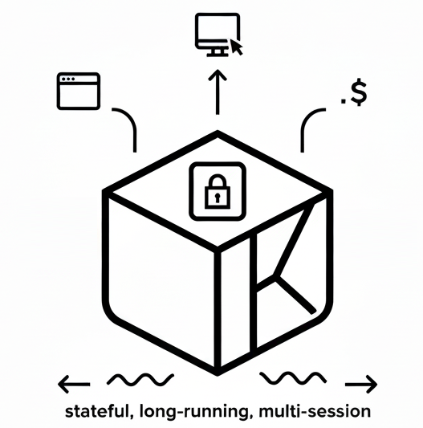

<div align="center">
  <h1 align="center">Agent-Sandbox</h1>
  <p align="center">Enterprise-grade Kubernetes based cloud-native high-performance, multi-session, multi-tenant. Code execution, Browser use, Computer use etc. runtime environment for AI Agents.</p>
<picture>
  <source srcset="./docs/agent-sandbox.png" type="image/png">
  
</picture>
</div>
Agent-sandbox is an enterprise-grade ai-first, cloud-native, high-performance runtime environment designed for AI Agents. It combines the Kubernetes
with container isolation. Allows Agents to securely run untrusted LLM-generated Code, Browser use, Computer use, and
Shell commands etc. with stateful, long-running, multi-session and multi-tenant.

## Features

- **AI Agent Runtimes** - Supports various AI agent runtimes, including code execution, browser automation, computer use, and shell command execution.
- **Enterprise-Grade** - Support multiple Sandbox lifecycle manage for each tenant or session, allowing Agents to run different tasks simultaneously without interference for different tenant or session.
- **Ai-First** - Agents automatically manage whole Sandbox's lifecycle by the MCP( Model Context Protocol ) , making it easy to manage Sandbox various environments.
- **Cloud-Native** - Leverages Kubernetes built to run in cloud environments, leveraging the benefits of cloud infrastructure such as scalability, flexibility, resilience and efficient resource management.
- **Fast and Lightweight** - Designed to be lightweight and fast, minimizing Kubernetes's objects to deploy. easy to use and maintain.

## Quick Start

### 1, Installation
You can install Agent-Sandbox by applying the provided [install.yaml](https://github.com/agent-sandbox/agent-sandbox/blob/main/install.yaml) file to your Kubernetes cluster. requires Kubernetes version 1.24 or higher.
```
kubectl create namespace agent-sandbox
kubectl apply -nagent-sandbox -f install.yaml
```
You can create an ingress or port-forward to access the Agent-Sandbox API server. Ingress like this:
```yaml
apiVersion: networking.k8s.io/v1
kind: Ingress
metadata:
  name: agent-sandbox
  namespace: agent-sandbox
spec:
  ingressClassName: ingress-nginx
  rules:
  - host: agent-sandbox.your-host.com
    http:
      paths:
      - backend:
          service:
            name: agent-sandbox
            port:
              number: 80
        path: /(.*)
```
Now you can access the Agent-Sandbox API server at `http://agent-sandbox.your-host.com`.

### 2, Usage
#### Create a sandbox

#### Connect to sandbox 


## License

[Apache License](./LICENSE)
