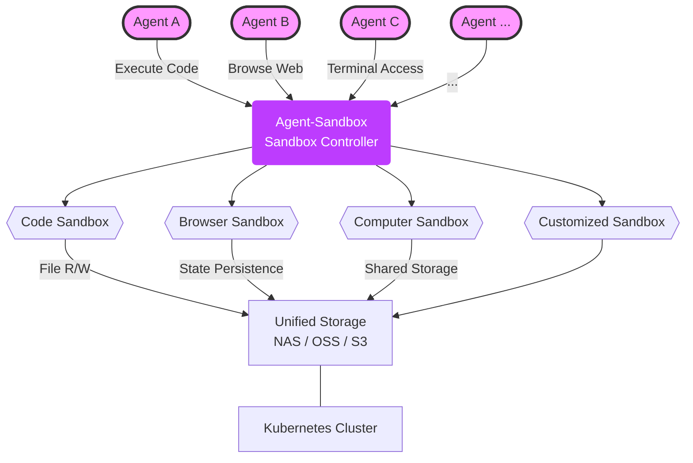
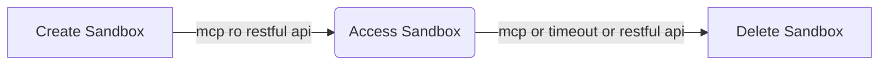
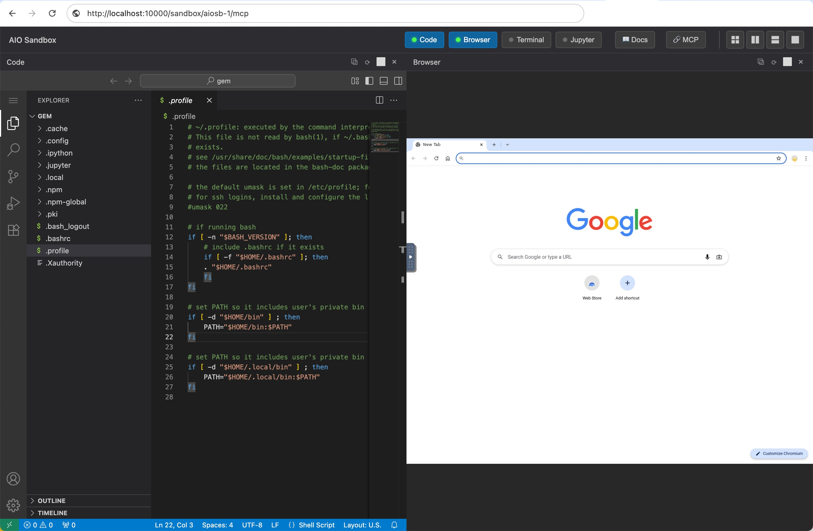

<div align="center">
  <h1 align="center">Agent-Sandbox</h1>
  <p align="center"><b> Agent-Sandbox is an open-sourced <a href="https://docs.blaxel.ai/Sandboxes/Overview">Blaxel Sandbox</a> or <a href="https://e2b.dev/">E2B</a> like solution! </b></p>
  <p align="center">Agent-Sandbox is an enterprise-grade ai-first, cloud-native, high-performance runtime environment designed for AI Agents. It combines the Kubernetes
with container isolation. Allows Agents to securely run untrusted LLM-generated Code, Browser use, Computer use, and
Shell commands etc. with stateful, long-running, multi-session and multi-tenant.</p>
<picture>
  <source srcset="./docs/agent-sandbox.png" type="image/png">
  
</picture>
</div>


# Why Agent-Sandbox?

When we are developing AI Agents, one of the critical challenges is providing an Enterprise-Grade&Production-Grade environment for executing untrusted code and performing various tasks, that is **Multi-Session and Multi-Tenant**.

Sandbox must be isolated on a **Per-Agent** even **Per-User** basis to ensure security and prevent interference **between different conversation or task**. Additionally, the sandbox environment should support state persistence, allowing agents to maintain context and data across multiple interactions or multi agents etc.

So, **Multi-Session and Multi-Tenant** is very critical,  Each sandbox is isolated on a per-agent or per-user basis, ensuring security and preventing interference between different conversations or tasks.

I found [kubernetes-sigs/agent-sandbox](https://github.com/kubernetes-sigs/agent-sandbox) leverages [AIO Sandbox](https://github.com/agent-infra/sandbox) and Kubernetes to provide a similar solution. But it seems not friendly for AI Agents to manage the sandbox lifecycle and not friendly for commonly users to use it, because it faces to Kubernetes directly.

So, We decide created this **Agent-Sandbox** project, which provides a RESTful API and MCP(Model Context Protocol) server to manage the sandbox lifecycle easily. It abstracts the complexity of Kubernetes and provides a simple interface for AI Agents and users to create, access, and delete sandboxes as needed. And we refer to some design ideas from [Blaxel Sandbox](https://docs.blaxel.ai/Sandboxes/Overview) and [E2B](https://e2b.dev/) provide similar features like lifecycle management and API design. Making it more suitable for AI Agents to use, but is opensource and self-hosted.



# Features
- **Ai-First** - Agents automatically manage whole Sandbox's lifecycle by the MCP( Model Context Protocol ) , making it easy to manage various Sandbox environments and access them automatically.
- **AI-Agent Runtimes** - Supports various AI agent runtimes, including code execution, browser automation, computer use, and shell command execution and easy to customize more runtimes.
- **Enterprise-Grade** - Support multiple Sandbox lifecycle manage for each tenant or session, allowing Agents to run different tasks simultaneously without interference for different tenant or session.
- **Cloud-Native** - Leverages Kubernetes built to run in cloud environments, leveraging the benefits of cloud infrastructure such as scalability, flexibility, resilience and efficient resource management.
- **Fast and Lightweight** - Designed to be lightweight and fast, minimizing Kubernetes's objects to deploy. easy to use and maintain.

# Quick Start

## 1, Installation
You can install Agent-Sandbox by applying the provided [install.yaml](https://github.com/agent-sandbox/agent-sandbox/blob/main/install.yaml) file to your Kubernetes cluster. requires Kubernetes version 1.24 or higher.
```
kubectl create namespace agent-sandbox
kubectl apply -nagent-sandbox -f install.yaml
```
You can create an ingress or port-forward to access the Agent-Sandbox API server. Ingress like this:
```yaml
apiVersion: networking.k8s.io/v1
kind: Ingress
metadata:
  name: agent-sandbox
  namespace: agent-sandbox
spec:
  ingressClassName: ingress-nginx
  rules:
  - host: agent-sandbox.your-host.com
    http:
      paths:
      - backend:
          service:
            name: agent-sandbox
            port:
              number: 80
        path: /(.*)
```
Now you can access the Agent-Sandbox API server at `http://agent-sandbox.your-host.com`.

## 2, Usage
The Agent-Sandbox provides a RESTful API or MCP to manage sandboxes. The typical workflow involves creating a sandbox, accessing it, and then deleting it when no longer needed.



### 2.1, Agent-Sandbox MCP Server
You can manage sandboxes using the Model Context Protocol (MCP) with your AI Agents. The MCP server allows Agents to create, access, and delete sandboxes automatically.

MCP Server Address: `http://agent-sandbox.your-host.com/mcp`. Now support SSE(Streamable-http).

#### MCP Demos:

---

### 2.2, RESTful API
You can also manage sandboxes manually using the RESTful API provided by Agent-Sandbox.

#### I, Create a Sandbox
You can create a new sandbox by sending a POST request to the `/api/v1/sandbox` endpoint with the desired configuration. For example, to create an `aio` type sandbox and name it `sandbox-aio-01`, you can use the following curl command or programmatically call the API:
```shell
curl --location '/api/v1/sandbox' \
--header 'Content-Type: application/json' \
--data '{"name":"sandbox-01"}'
```

#### II, Access to Sandbox
`/sandbox/{sandbox_name}` endpoint to get the access of the sandbox, including the connection details such as URL, WebSocket URL, VNC URL, or other relevant information based on the sandbox type.

Now you can access to the previously created **sandbox-aio-01** sandbox using `/sandbox/sandbox-aio-01`.

You will see:  



And this created Sandbox's MCP Server address is: `sandbox/sandbox-aio-01/mcp`. you can use this MCP Server with your AI Agent to access this sandbox.

#### III, Delete a Sandbox
You can delete a sandbox by sending a DELETE request to the `/api/v1/sandbox/{sandbox_name}` endpoint. For example, to delete the `sandbox-aio-01` sandbox, you can use the following curl command or programmatically call the API:
```shell
curl --location --request DELETE '/api/v1/sandbox/sandbox-aio-01'
```


# License

[Apache License](./LICENSE)
