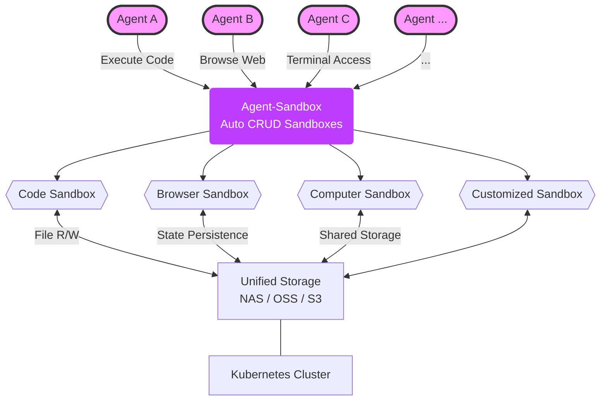
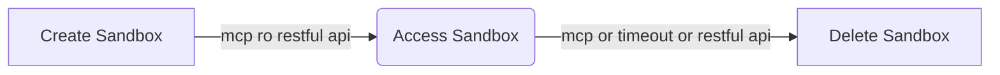
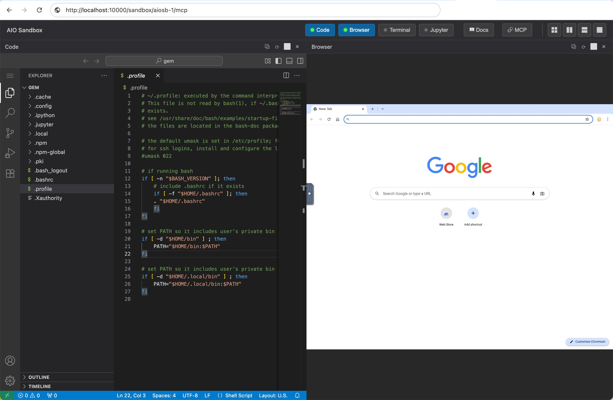

<div align="center">
  <picture >
  
  </picture>

  <p align="center"><b> Agent-Sandbox is an open-sourced <a href="https://docs.blaxel.ai/Sandboxes/Overview">Blaxel Sandbox</a> or <a href="https://e2b.dev/">E2B</a> like solution! </b>

<b>🎉🎉🎉 Complete compatible with <a href="https://e2b.dev/">E2B</a> protocol and SDKs.✅</b>
</p>
<br/>
  <p align="center">Agent-Sandbox is an enterprise-grade ai-first, cloud-native, high-performance runtime environment designed for AI Agents. It combines the Kubernetes
with container isolation. Allows Agents to securely run untrusted LLM-generated Code, Browser use, Computer use, and
Shell commands etc. with stateful, long-running, multi-session and multi-tenant.</p>
</div>

<div align="center">
<h3>Agent-Sandbox UI</h3> 
<div>including Sandbox Management, Pool Management, Template Management and Files, Logs, Terminal, Traffic Monitor access Tools for Sandbox etc. <br><br/> UI path is <a href="https://agent-sandbox.domain.com/ui">https://agent-sandbox.domain.com/ui</a>.   
<br/>
  Default UI admin login token:  <b>sys-2492a85b10ed4cb083b2c76b181eac96</b>,  config user tokens by env variable <b>API_TOKENS_RAW</b> e.g. user1-2492a85b10ed4cb083b2c76b181eac00,user2-2492a85b10ed4cb083b2c76b181eac01 . 
</div>
  <br/><br/>
<div>
<a href="docs/imgs/uiimg-sbs.png" target="_blank">
    
</a>
</div>
<div>
<a href="docs/imgs/uiimg-pools.jpg" target="_blank">
    
</a>
<a href="docs/imgs/uiimg-files.jpg" target="_blank">
    
</a>
<a href="docs/imgs/uiimg-terminal.png" target="_blank">
    
</a>
<a href="docs/imgs/uiimg-tpl.jpg" target="_blank">
    
</a>
</div>
</div>

<hr/>

<div align="center">
<video src="https://github.com/user-attachments/assets/819c8534-a759-4ad0-9be5-7f95e6757168" autoplay loop muted playsinline >
    Your browser does not support the video tag.
</video>
<br/>
<h3>Agent Use Sandbox Demo</h3>
<br/>
<picture >
  
</picture>
</div>

---

# Why Agent-Sandbox?

When we are developing AI Agents, one of the critical challenges is providing an Enterprise-Grade&Production-Grade environment for executing untrusted code and performing various tasks, that is **Multi-Session and Multi-Tenant**.

Sandbox must be isolated on a **Per-Agent** even **Per-User** basis to ensure security and prevent interference **between different conversation or task**. Additionally, the sandbox environment should support state persistence, allowing agents to maintain context and data across multiple interactions or multi agents etc.

Therefore, **Multi-Session and Multi-Tenant** is very critical,  Each sandbox is isolated on a per-agent or per-user basis, ensuring security and preventing interference between different conversations or tasks.

I found [kubernetes-sigs/agent-sandbox](https://github.com/kubernetes-sigs/agent-sandbox) leverages [AIO Sandbox](https://github.com/agent-infra/sandbox) and Kubernetes to provide a similar solution. But it seems not friendly for AI Agents to manage the sandbox lifecycle and not friendly for commonly users to use it, because it faces to Kubernetes directly.

So, We decide created this **Agent-Sandbox** project, which provides a RESTful API and MCP(Model Context Protocol) server to manage the sandbox lifecycle easily. It abstracts the complexity of Kubernetes and provides a simple interface for AI Agents and users to create, access, and delete sandboxes as needed. And we refer to some design ideas from [Blaxel Sandbox](https://docs.blaxel.ai/Sandboxes/Overview) and [E2B](https://e2b.dev/) provide similar features like lifecycle management and API design. Making it more suitable for AI Agents to use, but is opensource and self-hosted.

## Full sandbox lifecycle manage by Agent-Sandbox MCP Server


## Architecture

```mermaid
flowchart TD
    A1([Agent A]):::agent -->|Execute Code| ASB
    A2([Agent B]):::agent -->|Browse Web| ASB
    A3([Agent C]):::agent -->|Terminal Access| ASB(Agent-Sandbox <br/> Auto CRUD Sandboxes)
    A4([Agent ...]):::agent -->|...| ASB
    
    ASB -->SB1{{Code Sandbox}}
    ASB -->SB2{{Browser Sandbox}}
    ASB -->SB3{{Computer Sandbox}}
    ASB -->SB4{{Customized Sandbox}}
    
    SB1 <-->|File R/W| V
    SB2 <-->|State Persistence| V
    SB3 <-->|Shared Storage| V
    SB4 <--> V[Unified Storage <br/> NAS / OSS / S3]
    
    V --- K[Kubernetes Cluster]
    
    style ASB fill:#bd3cfe,stroke:#333,stroke-width:0,color:#fff;
    classDef agent fill:#f9f,stroke:#333,stroke-width:3px;
```

# Features
- **🎉 E2B Fully-Compatible** - Fully compatible with [E2B](https://e2b.dev/) protocol and SDKs, allowing seamless integration with existing E2B-based AI Agents and tools, please refer to usage in `examples/` directory.
- **Ai-First** - Agents automatically manage whole Sandbox's lifecycle by the MCP( Model Context Protocol ) , making it easy to manage various Sandbox environments and access them automatically.
- **AI-Agent Runtimes** - Supports various AI agent runtimes, including code execution, browser automation, computer use, and shell command execution and easy to customize more runtimes.
- **Enterprise-Grade** - Support multiple Sandbox lifecycle manage for each tenant or session, allowing Agents to run different tasks simultaneously without interference for different tenant or session.
- **Cloud-Native** - Leverages Kubernetes built to run in cloud environments, leveraging the benefits of cloud infrastructure such as scalability, flexibility, resilience and efficient resource management.
- **Fast and Lightweight** - Designed to be lightweight and fast, minimizing Kubernetes's objects to deploy. easy to use and maintain.
- **Traffic Monitor** - Live HTTP/HTTPS traffic inspection per sandbox via a mitmproxy sidecar, streamed in real-time to the UI.

# Quick Start

## 1, Installation
You can install Agent-Sandbox by applying the provided [install.yaml](https://github.com/agent-sandbox/agent-sandbox/blob/main/install.yaml) file to your Kubernetes cluster.

requires **Kubernetes version 1.26** or higher.
```bash
kubectl create namespace agent-sandbox
kubectl apply -nagent-sandbox -f install.yaml
```
You can create an ingress or port-forward to access the Agent-Sandbox API server. Ingress like this:
```yaml
apiVersion: networking.k8s.io/v1
kind: Ingress
metadata:
  name: agent-sandbox
  namespace: agent-sandbox
spec:
  ingressClassName: ingress-nginx
  rules:
  - host: agent-sandbox.your-host.com
    http:
      paths:
      - backend:
          service:
            name: agent-sandbox
            port:
              number: 80
        path: /
```
Now you can access the Agent-Sandbox API server at `http://agent-sandbox.your-host.com`.

## 2, Usage
The Agent-Sandbox provides a RESTful API or MCP to manage sandboxes. The typical workflow involves creating a sandbox, accessing it, and then deleting it when no longer needed.

```mermaid
flowchart LR

A[Create Sandbox] -->|mcp ro restful api| B(Access Sandbox)-->|mcp or timeout or restful api| C[Delete Sandbox]
```


### 2.1, Use Agent-Sandbox MCP Server
You can manage sandboxes using the Model Context Protocol (MCP) with your AI Agents. The MCP server allows Agents to create, access, and delete sandboxes automatically.

MCP Server Address: `http://agent-sandbox.your-host.com/mcp`. Now support SSE(Streamable-http).

#### MCP Demos:

##### 1, Code Execution

Agents automatically create a sandbox when code needs to be executed and delete it when execution completes, ensuring isolated and secure code runs.

[code execution](https://github.com/user-attachments/assets/d6ee410f-e12c-4c40-9dcc-f16b3b1abade)


##### 2, Browser Use

Agents automatically create a sandbox when website access is needed and delete it when the task is finished, providing isolated browser sessions for web interactions.

[browser use](https://github.com/user-attachments/assets/e75daeb0-2bce-4144-9c2e-9c7979c21a05)


This MCP integration enables agents to manage sandbox resources without manual intervention, supporting multi-session and multi-tenant operations with automatic cleanup.

---

### 2.2, Use RESTful API
You can also manage sandboxes manually using the RESTful API provided by Agent-Sandbox.

#### I, Create a Sandbox
You can create a new sandbox by sending a POST request to the `/api/v1/sandbox` endpoint with the desired configuration. For example, to create an `aio` sandbox and name it `sandbox-01`, you can use the following curl command or programmatically call the API:

<table>
<tr>
<td valign="top">

**Shell**
```shell
curl --location '/api/v1/sandbox' \
--header 'Content-Type: application/json' \
--data '{"name":"sandbox-01"}'
```
for China user, please specify the local aio image registry to improve the pull speed:
```shell
curl --location '/api/v1/sandbox' \
--header 'Content-Type: application/json' \
--data '{"name":"sandbox-01","image":"enterprise-public-cn-beijing.cr.volces.com/vefaas-public/all-in-one-sandbox:latest"}'
```

</td>
<td>

**Python**
```python
import requests
import json

url = "/api/v1/sandbox"

payload = json.dumps({
  "name": "sandbox-01"
})
headers = {
  'Content-Type': 'application/json'
}

response = requests.request("POST", url, headers=headers, data=payload)

print(response.text)
```
</td>
</tr>
</table>

**Result**
```json
{
    "code": "0",
    "data": "Sandbox sandbox-01 created successfully"
}
```

#### II, Access to Sandbox
`/sandbox/{sandbox_name}` endpoint to get the access of the sandbox, including the connection details such as URL, WebSocket URL, VNC URL, or other relevant information based on the sandbox template.

Now you can access to the previously created **sandbox-01** sandbox using `/sandbox/sandbox-01`.

**You will see:**


**Use agent sandbox SDK access this sandbox:**
```python
from agent_sandbox import Sandbox

# Initialize client
client = Sandbox(base_url="http://agent-sandbox.your-host.com/sandbox/sandbox-01")
home_dir = client.sandbox.get_context().home_dir

# Execute shell commands
result = client.shell.exec_command(command="ls -la")
print(result.data.output)

# File operations
content = client.file.read_file(file=f"{home_dir}/.bashrc")
print(content.data.content)

# Browser automation
screenshot = client.browser.screenshot()
```

And this created Sandbox's MCP Server address is: `/sandbox/sandbox-01/mcp`. you can use this MCP Server with your AI Agent to access this sandbox.

For more usage, please refer to: https://github.com/agent-infra/sandbox

#### III, Delete a Sandbox
You can delete a sandbox by sending a DELETE request to the `/api/v1/sandbox/{sandbox_name}` endpoint. For example, to delete the `sandbox-01` sandbox, you can use the following curl command or programmatically call the API:


<table>
<tr>
<td valign="top">

**Shell**
```shell
curl --location --request DELETE '/api/v1/sandbox/sandbox-01'
```

</td>
<td>

**Python**
```python
import requests

url = "/api/v1/sandbox/sandbox-01"

headers = {
  'Content-Type': 'application/json'
}

response = requests.request("DELETE", url, headers=headers)

print(response.text)
```
</td>
</tr>
</table>

**Result:**

```json
{
    "code": "0",
    "data": "Sandbox sandbox-01 deleted successfully"
}
```


# Sandbox Proxy Routing

When a sandbox runs a web application, Agent-Sandbox can proxy HTTP traffic directly to the sandbox pod. Two routing strategies are available — choose based on the complexity of the app being served.

## Option 1 — Path-based Proxy (built-in, zero config)

Every sandbox is accessible at:

```
https://agent-sandbox.your-host.com/sandbox/{sandbox-name}/
```

The server strips the `/sandbox/{name}` prefix before forwarding the request to the pod, and automatically injects a `<base href="/sandbox/{name}/">` tag into every HTML response so that relative asset paths resolve correctly through the proxy.

**Best for:** simple UIs and static HTML apps that do not use JavaScript `fetch()` calls with absolute paths.

**Limitations:** JavaScript-side requests using absolute paths (e.g. `fetch('/api/data')`) and WebSocket connections will not resolve through the proxy prefix. For those, use Option 2.

No configuration required — this proxy is always active.

---

## Option 2 — Subdomain-based Proxy (full compatibility)

Each sandbox is exposed on its own subdomain:

```
https://{sandbox-name}.s.your-host.com/
```

The request is forwarded to the pod unchanged — no path stripping, no HTML rewriting. The app receives requests at `/` and all paths resolve naturally, including JS `fetch()` calls and WebSockets.

**Best for:** full SPAs, Next.js / Vite apps, Jupyter, code-server, and anything that uses WebSocket connections or absolute API paths.

### Prerequisites

1. **DNS** — Add a wildcard A record pointing to the same IP as your Agent-Sandbox host:

   | Type | Name | Content |
   |------|------|---------|
   | A | `*.s` | `<your server IP>` |

2. **TLS** — Add `*.s.your-host.com` to your wildcard certificate's `dnsNames`:

   ```yaml
   spec:
     dnsNames:
       - "*.your-host.com"
       - "*.s.your-host.com"   # add this
   ```

3. **Ingress / Gateway** — Add a route that matches `*.s.your-host.com` and forwards to the Agent-Sandbox service.

   **Nginx Ingress example:**
   ```yaml
   apiVersion: networking.k8s.io/v1
   kind: Ingress
   metadata:
     name: agent-sandbox-wildcard
   spec:
     ingressClassName: nginx
     tls:
       - hosts:
           - "*.s.your-host.com"
         secretName: wildcard-cert
     rules:
       - host: "*.s.your-host.com"
         http:
           paths:
             - path: /
               pathType: Prefix
               backend:
                 service:
                   name: agent-sandbox
                   port:
                     number: 80
   ```

   **Cilium / Gateway API example:**
   ```yaml
   apiVersion: gateway.networking.k8s.io/v1
   kind: HTTPRoute
   metadata:
     name: agent-sandbox-wildcard
   spec:
     parentRefs:
       - name: <your-gateway-name>
         namespace: <your-gateway-namespace>
     hostnames:
       - "*.s.your-host.com"
     rules:
       - matches:
           - path:
               type: PathPrefix
               value: /
         backendRefs:
           - name: agent-sandbox
             port: 80
   ```

4. **Enable in Agent-Sandbox** — Set the `SANDBOX_PROXY_DOMAIN` environment variable on the Agent-Sandbox deployment:

   ```yaml
   env:
     - name: SANDBOX_PROXY_DOMAIN
       value: "s.your-host.com"
   ```

   When this variable is set, any request whose `Host` header matches `*.s.your-host.com` is routed directly to the corresponding sandbox pod. When left empty (default), subdomain routing is disabled and only Option 1 is active.

### How the sandbox name is resolved

The sandbox name (and optional port) are extracted from the first label of the hostname:

```
sbx-myapp-abc123.s.your-host.com          → sandbox: sbx-myapp-abc123, port: default
sbx-myapp-abc123-6080.s.your-host.com     → sandbox: sbx-myapp-abc123, port: 6080
```

Encoding the port in the subdomain ensures that every request the browser makes — HTML, assets, API calls, WebSocket upgrades — all reach the correct port automatically. This is the recommended approach for sandboxes that expose multiple ports (e.g. a noVNC server on `6080` alongside an API on `8080`).

The name must match an existing running sandbox. If no pod is found for that name, the proxy returns `502 Bad Gateway`.

---

## Comparison

| | Path proxy | Subdomain proxy |
|---|---|---|
| URL pattern | `/sandbox/{name}/` | `{name}.s.your-host.com` |
| HTML asset loading | fixed via `<base>` tag | native |
| JS `fetch('/api/...')` | broken | works |
| WebSockets | broken | works |
| Cookie scope | shared host | isolated per sandbox |
| DNS / infra changes | none | wildcard DNS + cert |
| Config required | none | `SANDBOX_PROXY_DOMAIN` env var |

Both options can run simultaneously. Path proxy serves as a fallback for simple apps; subdomain proxy handles everything else.

---

# Traffic Monitor

Agent-Sandbox includes a live HTTP/HTTPS traffic inspector that shows every request a sandbox makes, in real time.

## How it works

When a sandbox is started with `metadata.mitm=true`, one init container and one sidecar are injected into its pod:

1. **`mitm-cert-gen`** (init container) — generates a mitmproxy CA certificate into a shared `emptyDir` volume, creates a combined CA bundle (system CAs + mitmproxy CA), and writes a Python `sitecustomize.py` that patches `certifi` to trust the mitmproxy CA. The volume is then mounted read-only into the sandbox container at `/mitm-ca`.
2. **`mitmproxy`** sidecar — installs `iptables` and redirects all outbound TCP traffic on ports 80 and 443 (from any UID other than its own) to `mitmdump` running in transparent mode on port 8877, using a Python addon (`logger.py`) to emit JSON log lines to stdout.

The backend tails those JSON lines from the pod logs and streams them over a WebSocket (`GET /api/v1/traffic/sandbox/{name}/ws`). The UI Traffic page connects to that socket and renders a live, color-coded table of flows.

## One-time cluster setup

Apply the addon ConfigMap once per cluster (same namespace as your sandboxes):

```bash
kubectl apply -n agent-sandbox -f - <<'EOF'
apiVersion: v1
kind: ConfigMap
metadata:
  name: agent-sandbox-mitm-addon
  namespace: agent-sandbox
data:
  logger.py: |
    import json, time
    from mitmproxy import http

    MAX_BODY = 10240  # 10 KB cap per body

    def _decode(data: bytes) -> str:
        if not data:
            return ""
        return data[:MAX_BODY].decode("utf-8", errors="replace")

    class TrafficLogger:
        def response(self, flow: http.HTTPFlow) -> None:
            entry = {
                "type": "flow",
                "timestamp": flow.request.timestamp_start,
                "method":    flow.request.method,
                "url":       flow.request.pretty_url,
                "host":      flow.request.pretty_host,
                "path":      flow.request.path,
                "status":    flow.response.status_code,
                "req_size":  len(flow.request.content or b""),
                "res_size":  len(flow.response.content or b""),
                "req_body":  _decode(flow.request.content),
                "res_body":  _decode(flow.response.content),
                "req_headers": dict(flow.request.headers),
                "res_headers": dict(flow.response.headers),
                "content_type": flow.response.headers.get("content-type", ""),
                "duration_ms": round(
                    (flow.response.timestamp_end - flow.request.timestamp_start) * 1000
                ),
            }
            print(json.dumps(entry), flush=True)

        def error(self, flow: http.HTTPFlow) -> None:
            msg = str(flow.error)
            if "Client disconnected" in msg:
                return  # suppress noisy TCP disconnect events
            entry = {
                "type":      "error",
                "timestamp": time.time(),
                "url":       flow.request.pretty_url if flow.request else "",
                "message":   msg,
            }
            print(json.dumps(entry), flush=True)

    addons = [TrafficLogger()]
EOF
```

## Enable traffic monitoring for a sandbox

Pass `mitm=true` in the sandbox metadata at creation time:

```shell
curl -X POST /api/v1/sandbox \
  -H 'Content-Type: application/json' \
  -d '{"name":"my-sandbox","metadata":{"mitm":"true"}}'
```

Then open **Traffic** in the sidebar of the UI and select the sandbox. All outbound HTTP/HTTPS requests will appear as a live, color-coded table (green = 2xx, yellow = 3xx, orange = 4xx, red = 5xx).

## HTTPS decryption

**Python and Node.js HTTPS is decrypted automatically.** When `mitm=true` is set, the sandbox template injects the following into the sandbox container at startup:

| Mechanism | Covers |
|---|---|
| `REQUESTS_CA_BUNDLE=/mitm-ca/combined-ca.pem` | Python `requests`, `httpx`, etc. |
| `SSL_CERT_FILE=/mitm-ca/combined-ca.pem` | OpenSSL-linked tools (`curl`, etc.) |
| `NODE_EXTRA_CA_CERTS=/mitm-ca/mitmproxy-ca-cert.pem` | Node.js TLS |
| `NPM_CONFIG_CAFILE=/mitm-ca/combined-ca.pem` | npm |
| `PYTHONPATH=/mitm-ca` (`sitecustomize.py`) | Python `certifi`-based libraries |
| `/mitm-ca/bin` prepended to `PATH` | `node`/`npm`/`npx` wrapper scripts |
| `/etc/ssl/certs/mitmproxy-ca-cert.pem` (subPath mount) | Go (`crypto/tls` reads all `.pem` files in that directory) |

No extra configuration is needed for these runtimes — full request/response bodies appear automatically in the traffic table.

### Other languages (Go, Rust, Java, …)

Languages that read from the OS trust store do not pick up the env vars above. However, Go's `crypto/tls` reads every `.pem` file in `/etc/ssl/certs/` — not just the bundle file. The sandbox template mounts the mitmproxy CA cert directly into that directory via a Kubernetes `subPath` volume mount, so **Go is also covered automatically** with no extra steps.

For Rust (`rustls`) and Java, which use their own bundled CA stores and don't read the system directory, HTTPS flows still appear in the traffic table as `CONNECT` tunnel entries — destination host and timing are visible, but not the decrypted content. To fix those you would need to add the CA to the runtime's own trust store in your image.

## WebSocket API

```
GET /api/v1/traffic/sandbox/{name}/ws?api_key=<token>
```

Each frame is a JSON object:

```json
{
  "type": "flow",
  "timestamp": 1712000000.123,
  "method": "POST",
  "url": "https://api.example.com/data",
  "status": 200,
  "req_size": 512,
  "res_size": 1234,
  "req_body": "{\"key\":\"value\"}",
  "res_body": "{\"result\":\"ok\"}",
  "content_type": "application/json",
  "duration_ms": 84
}
```

Error frames have `"type": "error"` with a `"message"` field. Returns HTTP `400` if the sandbox was not started with `mitm=true`.

---

# License

[Apache License](./LICENSE)
