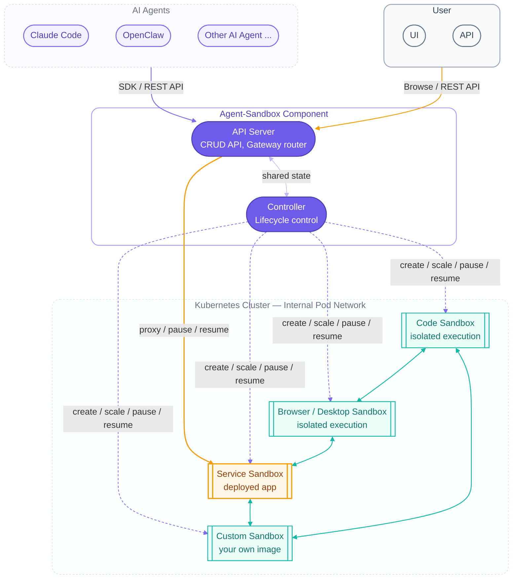

<div align="center">
  

  <h3>One Deployment. Every sandbox your agent needs.</h3>

  <p>
    
    
    
    <a href="https://agent-sandbox.github.io"></a>
  </p>

  <p>
    Self-hosted, lightweight, and easy-to-use sandbox runtime for AI Agents<br/>
  </p>
</div>

---

# Why Agent-Sandbox?

When you're building AI Agents, one of the hardest infra problems is running untrusted, LLM-generated code and actions safely — with **multi-session and multi-tenant** isolation, so one agent's runaway task never touches another's.

Each sandbox needs to be isolated on a **per-agent, or even per-user** basis, and needs to persist state across turns so an agent can keep context across multiple interactions.

[kubernetes-sigs/agent-sandbox](https://github.com/kubernetes-sigs/agent-sandbox) solves this with [AIO Sandbox](https://github.com/agent-infra/sandbox) and Kubernetes, but it talks to Kubernetes directly — great if you're a platform team, painful if you're an agent or a developer who just wants a sandbox.

So we built **Agent-Sandbox**: it wraps that same Kubernetes foundation behind a RESTful API and an MCP server, so agents and humans can create, use, and delete sandboxes without ever touching `kubectl`. The API and lifecycle model borrow ideas from [Blaxel Sandbox](https://docs.blaxel.ai/Sandboxes/Overview) and [E2B](https://e2b.dev/) — but this one is open-source and self-hosted.

# Features

### 🪶 Lightweight, easy to run
- **One component, one command.** `kubectl apply -f install.yaml` and you're live in under a minute. No etcd, no database, no message queue — Agent-Sandbox stores everything it needs (templates, blueprints, sandbox state) as native Kubernetes objects (ConfigMaps, ReplicaSets, Leases), so the cluster you already have is the only infra required.
- **Built-in Web UI**, baked into the same image — inspect and manage sandboxes, templates, and pools without deploying a separate dashboard.
- Minimizes the Kubernetes objects created per sandbox (a single ReplicaSet, no CRDs to install), so it stays cheap to run and easy to reason about in production.

### 🧩 Feature-complete for AI sandbox workloads
- **Full E2B protocol & SDK compatibility** — a drop-in replacement for existing E2B-based agents and tools.
- Covers the full surface AI agents actually need: **code execution, browser use, computer/desktop use (VNC/GUI), and shell access** — with SDKs and Skills so agents manage sandbox lifecycle themselves, end to end.
- Production concerns are built in, not bolted on: **multi-tenant isolation** (per-agent/per-user), a **Sandbox Pool** that pre-warms instances for low-latency allocation, **Pause/Resume**, **Snapshot**, **scale-to-zero** on idle/timeout, **leader election** for high availability, and **events & metrics** for observability.

### 🔧 Flexible, built to be extended
- Two independent, live-editable layers instead of one rigid template: **Blueprint** decides *how* a sandbox is deployed (the underlying ReplicaSet spec), and **Template** decides *what* sandbox types exist (which image, ports, resources). Edit either from the UI — no redeploy required.
- **Dynamic Template.** Register a Template matched by regex (e.g. `faas-code-(?P<name>.+)\.(?P<version>.+)$`) to serve a whole family of images through a single rule.
- Per-template resource limits, warmup commands, and pool sizing, so a heavyweight desktop sandbox and a tiny code-interpreter sandbox can coexist with very different cost profiles.

## Architecture

```mermaid
flowchart TD
    subgraph AGENTS["AI Agents"]
        direction TB
        CC(["Claude Code"]):::agent
        OC(["OpenClaw"]):::agent
        OT(["Other AI Agent ..."]):::agent
    end

    subgraph USER["User"]
        direction TB
        UI(["UI"]):::human
        UAPI(["API"]):::human
    end

    subgraph ASBGROUP["Agent-Sandbox Component"]
        direction TB
        APIS(["API Server<br/>CRUD API, Gateway router"]):::core
        CTL(["Controller<br/>Lifecycle control"]):::core
        APIS <-->|shared state| CTL
    end

    AGENTS -->|SDK / REST API| APIS
    USER -->|Browse / REST API| APIS

    APIS -->|proxy / pause / resume| SB3

    CTL -.->|create / scale / pause / resume| SB1
    CTL -.->|create / scale / pause / resume| SB2
    CTL -.->|create / scale / pause / resume| SB3
    CTL -.->|create / scale / pause / resume| SB4

    subgraph NET["Kubernetes Cluster — Internal Pod Network"]
        direction TB
        SB1[["Code Sandbox<br/>isolated execution"]]:::sandbox
        SB2[["Browser / Desktop Sandbox<br/>isolated execution"]]:::sandbox
        SB3[["Service Sandbox<br/>deployed app"]]:::sandboxExt
        SB4[["Custom Sandbox<br/>your own image"]]:::sandbox

        SB1 <--> SB2
        SB2 <--> SB3
        SB3 <--> SB4
        SB1 <--> SB4
    end

    classDef agent fill:#f3f1ff,stroke:#7c6cf0,stroke-width:1.5px,color:#4c3fb8
    classDef human fill:#f8fafc,stroke:#64748b,stroke-width:1.5px,color:#334155
    classDef core fill:#6c5ce7,stroke:#4c3fb8,stroke-width:1.5px,color:#ffffff
    classDef sandbox fill:#ecfdf9,stroke:#14b8a6,stroke-width:1.5px,color:#0f766e
    classDef sandboxExt fill:#fff7e6,stroke:#f59e0b,stroke-width:2px,color:#92400e

    style AGENTS fill:#fbfaff,stroke:#d8d6f5,stroke-width:1px,stroke-dasharray: 3 3,color:#6b7280,rx:14px,ry:14px
    style USER fill:#f8fafc,stroke:#94a3b8,stroke-width:1.5px,color:#334155,rx:14px,ry:14px
    style ASBGROUP fill:#ffffff,stroke:#a99dff,stroke-width:1.5px,color:#4c3fb8,rx:14px,ry:14px
    style NET fill:#fafefe,stroke:#cdeee7,stroke-width:1px,stroke-dasharray: 3 3,color:#6b7280,rx:14px,ry:14px

    linkStyle 0 stroke:#c4b5fd,stroke-width:1px
    linkStyle 1 stroke:#7c6cf0,stroke-width:1.5px
    linkStyle 2 stroke:#f59e0b,stroke-width:1.5px
    linkStyle 3 stroke:#f59e0b,stroke-width:2px
    linkStyle 4,5,6,7 stroke:#7c6cf0,stroke-width:1.2px,stroke-dasharray: 4 3
    linkStyle 8,9,10,11 stroke:#14b8a6,stroke-width:1.5px
```

# Quick Start

📚 For the full guide (deployment, auth, E2B SDK/CLI, REST API reference), see the docs site: **https://agent-sandbox.github.io**

## 1, Installation
You can install Agent-Sandbox by applying the provided [install.yaml](https://github.com/agent-sandbox/agent-sandbox/blob/main/install.yaml) file to your Kubernetes cluster.

requires **Kubernetes version 1.28** or higher.
```bash
kubectl create namespace agent-sandbox
kubectl apply -nagent-sandbox -f install.yaml
```
You can create an ingress or port-forward to access the Agent-Sandbox API server. Ingress like this:
```yaml
apiVersion: networking.k8s.io/v1
kind: Ingress
metadata:
  name: agent-sandbox
  namespace: agent-sandbox
spec:
  ingressClassName: ingress-nginx
  rules:
  - host: agent-sandbox.your-host.com
    http:
      paths:
      - backend:
          service:
            name: agent-sandbox
            port:
              number: 80
        path: /
```
Now you can access the Agent-Sandbox API server at `http://agent-sandbox.your-host.com`.

## 2, Usage
### via E2B Python SDK
**Requirements:**
```
e2b == 2.21.1
e2b-code-interpreter == 2.4.1
```

**Configure the E2B backend address:**
```bash
export E2B_API_KEY=testuser-aef134ef-7aa1-945e-9399-7df9a4ad0c3f
export E2B_DOMAIN=agent-sandbox.your-host.com
export E2B_API_URL=http://agent-sandbox.your-host/e2b/v1
```

**Python example:**
```python
from e2b_code_interpreter import Sandbox

idleTimeout = 60*10

# Create a sandbox instance from the "sandbox-base-node" template, 
# with an idle timeout of 10 minutes, 
# a lifecycle that pauses the sandbox and automatically resumes it when accessed again.
sbx = Sandbox.create(
    template="sandbox-base-node",
    timeout=-1,  # no hard lifetime; idle timeout owns reclamation
    metadata={"idleTimeout": str(idleTimeout)}, 
    lifecycle={"on_timeout": "pause", "auto_resume": True}, 
)
    
print(sbx.get_info())
#output: SandboxInfo(sandbox_id='02f53ee512e1413d86b730c6e122441e', sandbox_domain=None, template_id='sandbox-base-node', name=None, metadata={'idleTimeout': '600', 'name': 'sbx-testuser-sandbox-base-node-3f0d1fe4736b43bd9a30', 'snapshot': 'eyJjYXB0dXJlZF90aW1lIjoiMjAyNi0wNy0xNFQwNjo0MDowOC4wNjQ0NDU5ODNaIiwicHJvY2Vzc2VzIjpbeyJjb25maWciOnsiY21kIjoiL2Jpbi9iYXNoIiwiYXJncyI6WyItbCIsIi1jIiwicHl0aG9uIC1tIGh0dHAuc2VydmVyIDgwMDgiXX0sInBpZCI6MTZ9XX0='}, started_at=datetime.datetime(2026, 7, 14, 6, 40, 2, 5251, tzinfo=tzutc()), end_at=datetime.datetime(1, 1, 1, 0, 0, tzinfo=tzutc()), state=<SandboxState.RUNNING: 'running'>, cpu_count=50, memory_mb=200, envd_version='0.1.1', _envd_access_token='3f0d1fe4736b43bd9a306deccaf1bb1e', allow_internet_access=None, network=None, lifecycle={'on_timeout': <SandboxOnTimeout.KILL: 'kill'>, 'auto_resume': True}, volume_mounts=[])

# Run a background command in the sandbox
sbx.commands.run("npx serve -l 8008", background=True, timeout=0)

# Create processes snapshot for the sandbox, when the sandbox is resumed, 
# the background command can be restored automatically
sbx.create_snapshot()

# Upload file to sandbox
with open("README.md", "rb") as file:
    sbx.files.write("README.md", file)

f = sbx.files.list("/home")
print(f)
```

now you can manage the sandboxes via the built-in UI at `http://agent-sandbox.your-host.com/ui` or via the E2B SDK.
<div align="center">
<div>
<a href="docs/imgs/uiimg-sbxs.png" target="_blank">
    
</a>
</div>
<div>
Built-in UI, shipped in the same image — no separate dashboard to install. Default path: <code>http://agent-sandbox.your-host.com/ui</code>
<br/>
Default admin login token: <b>sys-2492a85b10ed4cb083b2c76b181eac96</b>
</div>
</div>


# Contributing🤝

Agent-Sandbox aims to stay simple, stable, and reliable rather than chasing every feature. That said, contributions genuinely help, whether it's a one-line fix or a new sandbox template. Found a bug, hit a rough edge, or have an idea? [Open an issue](https://github.com/agent-sandbox/agent-sandbox/issues).

If you're using Agent-Sandbox for something interesting, I'd love to hear about it.
