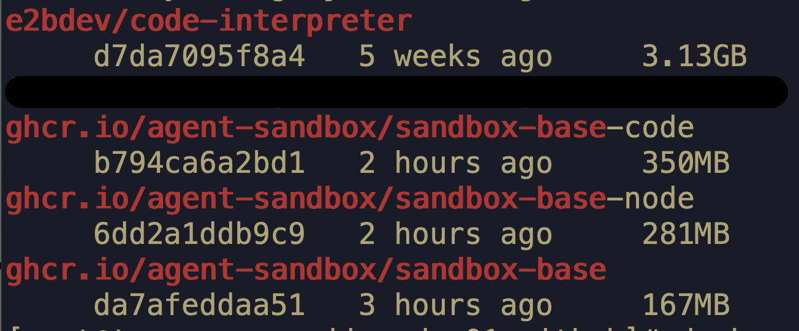

# Lightweight Sandbox Base Images

The official E2B image `e2bdev/code-interpreter:latest` exceeds 3GB in size. To reduce image size, improve pull efficiency while preserving full functionality, we rebuilt separate base images optimized for different scenarios.

## Image Description
### `sandbox-base` and `sandbox-base-node`
`sandbox-base` and `sandbox-base-node` are built on `python:3.12-slim-trixie` and `node:22-trixie-slim` respectively, preinstalled with common fundamental dependencies. Both images fall into the 200 MB size tier.

They provide Python or Node runtime environments, support native file I/O operations and other basic system commands, **but do not support the `run code` capability**.

Suitable for scenarios such as file manipulation and custom task execution.


### sandbox-base-code
`sandbox-base-code` is built on `python:3.12-slim-trixie` with Jupyter 2.20.0, falling into the 300 MB size tier.

It additionally enables the `run code` feature of `e2b_code_interpreter`. Designed for workloads requiring code execution.

# Usage
```
ghcr.io/agent-sandbox/sandbox-base:latest
ghcr.io/agent-sandbox/sandbox-base-code-node:latest
ghcr.io/agent-sandbox/sandbox-base-code-code:latest
```

## See also

- [custom template image](https://agent-sandbox.github.io/guides/custom_template_image/) — Building a Custom Template Image

## Changelog
### Initial Release v0.1.0, 2026-07-29
```
ghcr.io/agent-sandbox/sandbox-base:0.1.0
ghcr.io/agent-sandbox/sandbox-base-code-node:0.1.0
ghcr.io/agent-sandbox/sandbox-base-code-code:0.1.0
```

### v0.1.1, 2026-08-27
Export env of `WORKDIR`, And set read and write permissions to ensure user programs can read and use the working directory.

```
ghcr.io/agent-sandbox/sandbox-base:0.1.1
ghcr.io/agent-sandbox/sandbox-base-code-node:0.1.1
ghcr.io/agent-sandbox/sandbox-base-code-code:0.1.1
```